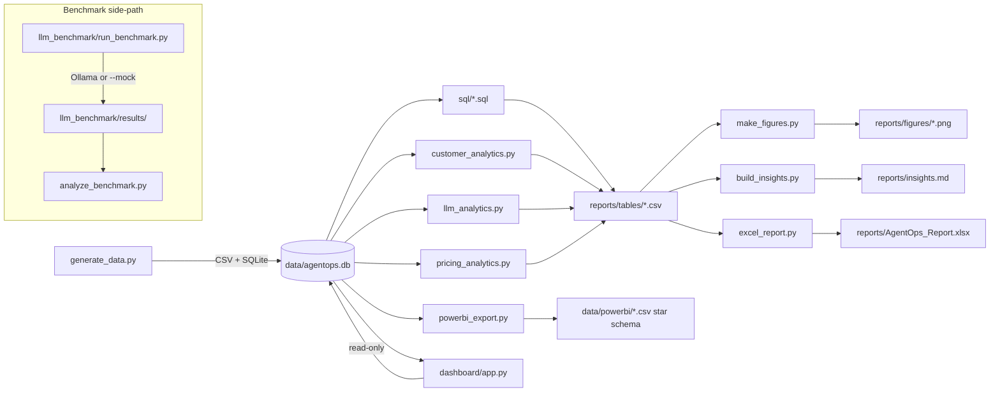

# AgentOps Analytics

End-to-end analytics on a simulated AI coding-agent SaaS: SQL + Python statistics + an Excel pricing simulator + a Power BI star schema + a Streamlit dashboard, plus a side-track that benchmarks real local LLMs. The project answers three kinds of questions a data/analytics team at a company like this would actually ask: **who sticks around and why** (customer activation, retention, churn), **which LLM model is worth what** (performance vs. cost, routing), and **is the pricing model actually profitable** (unit economics, experimentation, elasticity).

## Synthetic data

> **Synthetic data, by design.** The core dataset is a fictional company, **CodeShift** (a SaaS platform whose AI agents run coding tasks — migrations, bug fixes, test generation — for customers), generated by `src/generate_data.py` with known, deliberately-planted effects (an activation→retention link, a pricing flaw on legacy migrations, an under-powered A/B test, etc. — the full list is in `ARCHITECTURE.md`). The point of the project is that the analysis independently **rediscovers** those planted effects from the data alone — every number in `reports/insights.md` is computed live, nothing is hard-coded. Separately, `llm_benchmark/` ships with **MOCK** results (`results/results.csv` tagged accordingly) because this build machine has no Ollama install; it runs unmodified against real local models (see Getting started below).

## Highlights / key findings

- **Activation predicts everything.** Customers succeeding on all of their first 5 agent runs convert to paid 16pp more often than those with zero, and `activation_score` is the strongest driver of monthly churn in a discrete-time hazard model (odds ratio 0.35, customer-grouped holdout AUC 0.62). → *Invest in first-session success* (task templates, a "golden path" onboarding task). [figure](reports/figures/03_activation_vs_conversion_retention.png) · [odds ratios](reports/figures/04_churn_odds_ratios_forest_plot.png)
- **Team plan margin is the weakest paid plan**, 27pp below Enterprise, driven by flat per-task credits under-pricing expensive migration workloads. → *Move to complexity-weighted credits* for migration tasks. [figure](reports/figures/07_margin_by_plan.png)
- **Model ranking holds across task types** (no Simpson's-paradox reversal), but the *size* of each model's edge varies a lot by task. → *Trust the pooled leaderboard for coarse calls, but keep routing per-task.* [figure](reports/figures/05_model_task_success_heatmap.png)
- **Routing simple tasks to a cheaper model is free money; complex tasks are not.** An explicit cost-quality frontier policy finds real savings on simple tasks, while complex tasks (migrations, feature builds) have no cheaper model within 2pp of frontier success — that's a reliability investment, not a savings lever. [figure](reports/figures/06_cost_quality_pareto_frontier.png)
- **The Pro $29→$39 price test was underpowered**, not "no effect": p=0.15 at only ~30% achieved power, with roughly 4x the sample size per arm needed to detect the observed gap at 80% power. → *Don't conclude the price is safe; re-run properly powered.* [figure](reports/figures/09_ab_test_conversion_with_ci.png)
- **Failed runs alone burn a large, concentrated slice of LLM spend**, with one model/task combination dominating the failure cost. → *Add an early-exit / step-budget cap for runs trending toward failure.*

[Activation vs. conversion & retention](reports/figures/03_activation_vs_conversion_retention.png) · [Cost-quality Pareto frontier](reports/figures/06_cost_quality_pareto_frontier.png) · [Margin by plan](reports/figures/07_margin_by_plan.png)

## Architecture



| Component | Responsibility | Key files |
|---|---|---|
| Data generator | Simulates ~20 months of customers, billing, and agent runs with deliberately planted effects | `src/generate_data.py` |
| SQLite DB | Single source of truth all other components read from | `data/agentops.db`, `src/db.py` |
| SQL layer | 12 analytical queries: CTEs, window functions, parameterized-only access | `sql/*.sql`, `src/analysis/run_sql.py` |
| Analysis modules | Customer/churn/persona, LLM model×task, pricing/A-B-test statistics | `src/analysis/customer_analytics.py`, `src/analysis/llm_analytics.py`, `src/analysis/pricing_analytics.py` |
| Figures & insights builder | Renders PNG figures and assembles the auto-generated markdown report | `src/analysis/make_figures.py`, `src/analysis/build_insights.py` |
| Excel workbook + pricing simulator | Multi-sheet workbook with a live-formula pricing simulator | `src/excel_report.py`, `reports/AgentOps_Report.xlsx` |
| Power BI export | Star-schema CSV export + suggested DAX measures | `src/powerbi_export.py`, `data/powerbi/` |
| Streamlit dashboard | Interactive, read-only, filter-driven dashboard | `dashboard/app.py`, `dashboard/data.py`, `dashboard/charts.py` |
| LLM benchmark | Standalone real/mock local-LLM evaluation harness | `llm_benchmark/` |

## Data model

Six tables in `data/agentops.db` (full column-level spec in `ARCHITECTURE.md`):

| Table | Description | Key columns |
|---|---|---|
| `plans` | Pricing plan catalog | `plan`, `monthly_fee_usd`, `included_credits`, `overage_usd_per_credit` |
| `models` | LLM model cost/speed catalog | `model`, `usd_per_m_input`, `usd_per_m_output`, `sec_per_step` |
| `customers` | One row per customer, firmographics + lifecycle dates | `customer_id`, `signup_date`, `industry`, `company_size`, `acquisition_channel`, `current_plan`, `churn_date`, `status` |
| `customer_months` | One row per customer per active month (billing) | `customer_id`, `month`, `plan`, `monthly_fee_usd`, `credits_used`, `overage_revenue_usd`, `revenue_usd` |
| `agent_runs` | One row per agent run (~250k–400k rows) | `run_id`, `customer_id`, `task_type`, `model`, `status`, `llm_cost_usd`, `latency_sec`, `credits_charged`, `human_rating` |
| `experiment_assignments` | Pro price A/B test assignment | `customer_id`, `experiment_name`, `variant`, `pro_price_shown` |

The Power BI export (`data/powerbi/`) reshapes this into a star schema: 5 dimension tables (`dim_customer`, `dim_date`, `dim_plan`, `dim_model`, `dim_task`) with small integer surrogate keys, and 2 fact tables (`fact_agent_runs`, `fact_customer_month`) — see `data/powerbi/README.md` for relationships and suggested DAX measures (MRR, Gross Margin %, NRR, Success Rate, Activation Rate).

## Analytical methods

- Discrete-time survival (hazard) model for churn, with right-censoring handled via a person-period panel and a customer-grouped holdout split
- Kaplan–Meier estimator (hand-implemented) as a non-parametric cross-check on the hazard model
- KMeans clustering with silhouette-score model selection (and a minimum cluster-size constraint) for customer personas
- Simpson's-paradox stratification check on the LLM model leaderboard, plus a chi-square test of model vs. outcome
- Pareto cost-quality frontier for LLM routing, with bootstrapped confidence intervals on projected savings
- Two-proportion z-test for the pricing A/B test, backed by achieved-power and minimum-detectable-effect analysis
- Arc price elasticity of conversion
- Unit economics (cost-per-credit vs. revenue-per-credit) by plan, task type, and customer margin decile

## Dashboard

An interactive Streamlit app (`dashboard/app.py`) over the same SQLite database, with six tabs:

| Tab | What it shows |
|---|---|
| **Executive Overview** | KPI cards (MRR, revenue, gross margin, active paid customers, run success rate, NRR) with month-over-month deltas; MRR / revenue / LLM-cost trend |
| **Customers & Retention** | Cohort retention heatmap, activation vs. conversion and retention, acquisition-channel comparison |
| **LLM Performance** | Model × task success heatmap, cost-vs-success frontier, cost per successful run, migration-pair table, LLM spend burned on failed runs |
| **Pricing & Unit Economics** | Margin by plan, LLM cost per credit vs. revenue per credit by task, customer margin deciles |
| **Pricing Experiment** | Conversion by variant with Wilson CIs, two-proportion z-test, power / MDE note |
| **Routing Simulator** | Slider to move simple-task frontier runs to a cheaper model → projected savings and success-rate change |

Sidebar filters (month range, plan, region, acquisition channel, industry) only accept values that exist in the database and are passed to SQL as parameters. The database is opened read-only, and there is no free-text SQL box or file upload.

## Excel workbook

`reports/AgentOps_Report.xlsx` (built by `src/excel_report.py`) has sheets for a KPI dashboard with native charts, monthly/plan/model-task breakdowns, a customer-level summary table, a pivot-ready flat fact table, and a **Pricing Simulator** sheet. The simulator lets you change per-plan price, included credits, overage rate, price elasticity, the % of simple-task runs routed to a cheaper model, and a churn-rate assumption; margin and revenue recompute live via author-written formulas. Every live input sits next to a locked "Baseline (locked)" reference computed with the identical formula structure at status-quo values, so at default inputs the delta is exactly zero by construction — a hidden `_check` sheet independently recomputes every simulator output in Python to catch formula drift.

## LLM benchmark

`llm_benchmark/` is a standalone harness that runs real LLM output (via a local [Ollama](https://ollama.com) server, or `--mock` for offline testing) through the same evaluation lens as the `agent_runs` table: 15 coding tasks, each graded against hidden assert-based unit tests, producing pass@1/pass@k, Wilson confidence intervals, tokens/latency/cost, and a chi-square test of model vs. outcome.

**Security model:** untrusted model-generated code is graded in a separate subprocess (`python -I -S`), with a stripped environment, a fresh temp directory, POSIX resource limits, an audit hook blocking sockets/subprocess/exec/ctypes, and a wall-clock timeout — layered defenses, documented as a speed bump rather than a hard security boundary for untrusted code at scale.

```bash
# Mock mode — no Ollama needed:
make benchmark-mock

# Real mode — against local Ollama models:
ollama serve
ollama pull llama3.2
ollama pull qwen2.5-coder:1.5b
.venv/bin/python llm_benchmark/run_benchmark.py --models llama3.2 qwen2.5-coder:1.5b --repeats 3 --out llm_benchmark/results/results.csv
.venv/bin/python llm_benchmark/analyze_benchmark.py --results llm_benchmark/results/results.csv --out-dir llm_benchmark/results
```

## Getting started

Requirements: Python 3.11+ (developed against 3.14; pandas, numpy, scipy, statsmodels, scikit-learn, matplotlib, streamlit, openpyxl — see `requirements.txt`).

```bash
make setup        # venv + pinned dependencies
make data         # generate the synthetic dataset (CSV + SQLite)
make analysis     # SQL, statistics, figures, reports/insights.md
make excel        # Excel workbook + Power BI star schema
make dashboard    # interactive Streamlit dashboard
make test         # full pytest suite
make security     # bandit + pip-audit
```

## Testing & security

- **158 tests pass** (`.venv/bin/python -m pytest -q`) across data integrity, SQL, statistical methods, Excel/Power BI export safety, the dashboard, and the LLM-benchmark sandbox.
- **Parameterized SQL only** — every query is hard-coded project SQL run through `?`-parameter binding; no string-built SQL from any input. The dashboard opens SQLite strictly **read-only** (`file:...?mode=ro`, `uri=True`) and exposes only allow-listed filter widgets — no free-text SQL box, no file upload.
- **Formula-injection guard** — any text value written to the Excel workbook or Power BI CSVs that starts with `= + - @` is prefixed with `'` before being written, so spreadsheet software never interprets exported data as a formula.
- **Sandboxed benchmark grading** — untrusted model-generated code runs in a separate subprocess, with a clean environment, a fresh temp directory, POSIX resource limits, an audit hook blocking sockets/subprocess/exec/ctypes, and a wall-clock timeout.
- **Pinned dependencies** (`requirements.txt`, `==` everywhere) checked with `pip-audit`; static analysis via `bandit -r src dashboard llm_benchmark`.

## Repo structure

```
agentops-analytics/
  ARCHITECTURE.md              build spec / data-generation design
  README.md                    this file
  Makefile                     make data | analysis | excel | dashboard | test | security
  requirements.txt
  data/
    raw/*.csv                  generated tables
    agentops.db                SQLite
    powerbi/                   star-schema CSV export + README
  src/
    generate_data.py           synthetic data generator
    db.py                      connection + SQL-file runner helpers
    excel_report.py            Excel workbook incl. Pricing Simulator
    powerbi_export.py          Power BI star-schema export
    analysis/
      run_sql.py                sql/*.sql -> reports/tables/*.csv
      customer_analytics.py     activation, hazard/churn model, personas
      llm_analytics.py          model x task stats, routing policy
      pricing_analytics.py      unit economics, A/B test, elasticity, scenarios
      make_figures.py           reports/figures/*.png
      build_insights.py         reports/insights.md
      run_all.py                runs the full pipeline in order
  sql/                          12 analytical queries (CTEs, window functions)
  dashboard/                    Streamlit app (read-only, filter-driven)
  llm_benchmark/                real/mock local-LLM benchmark harness (Ollama)
  reports/{figures,tables}/     generated outputs
  tests/                        pytest suite (158 tests)
```

## Honest limitations

- All customer, revenue, and usage data is synthetic; findings describe the simulator's planted dynamics, not any real market.
- The churn hazard model's customer-grouped holdout AUC (0.62) is only modestly predictive out-of-sample — it should inform which levers to prioritize, not drive individual customer-level decisions.
- Pricing-scenario dollar projections apply a new price/credit schedule to *historical* volume and assume no behavioral response (no demand elasticity beyond the one explicitly modeled A/B-test elasticity).
- The LLM benchmark's committed results are **mock** (no Ollama on this build machine); real-model numbers require running it locally.
- Channel and other observational comparisons (e.g. acquisition channel vs. retention) are correlational, not causal — channel is confounded with company size and industry in this dataset.

## Author

Rohith G (GitHub: [Rohith0901](https://github.com/Rohith0901))
