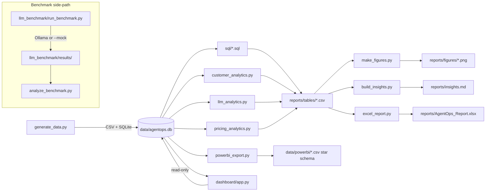

# AgentOps Analytics

End-to-end analytics on a simulated AI coding-agent SaaS: SQL + Python statistics + an Excel pricing simulator + Power BI star schema + a Streamlit dashboard, plus a side-track that benchmarks real local LLMs.

> **Synthetic data, by design.** The core dataset is a fictional company, **CodeShift** (a SaaS platform whose AI agents run coding tasks — migrations, bug fixes, test generation — for customers), generated by `src/generate_data.py` with known, deliberately-planted effects (an activation→retention link, a pricing flaw on legacy migrations, an under-powered A/B test, etc. — the full list is in `ARCHITECTURE.md`). The point of the project is that the analysis independently **rediscovers** those planted effects from the data alone — every number in `reports/insights.md` is computed live, nothing is hard-coded. Separately, `llm_benchmark/` ships with **MOCK** results (`results/results.csv` tagged accordingly) because this build machine has no Ollama install; it runs unmodified against real local models (see Quickstart below).

## Key findings

- **Activation predicts everything.** Customers succeeding on all of their first 5 agent runs convert to paid 16pp more often than those with zero, and `activation_score` is the strongest driver of monthly churn in a discrete-time hazard model (odds ratio 0.35, customer-grouped holdout AUC 0.62). → *Invest in first-session success* (task templates, a "golden path" onboarding task). [figure](reports/figures/03_activation_vs_conversion_retention.png) · [odds ratios](reports/figures/04_churn_odds_ratios_forest_plot.png)
- **Team plan margin is the weakest paid plan**, 27pp below Enterprise, driven by flat per-task credits under-pricing expensive migration workloads. → *Move to complexity-weighted credits* for migration tasks. [figure](reports/figures/07_margin_by_plan.png)
- **Model ranking holds across task types** (no Simpson's-paradox reversal), but the *size* of each model's edge varies a lot by task. → *Trust the pooled leaderboard for coarse calls, but keep routing per-task.* [figure](reports/figures/05_model_task_success_heatmap.png)
- **Routing simple tasks to a cheaper model is free money; complex tasks are not.** An explicit cost-quality frontier policy finds real savings on simple tasks, while complex tasks (migrations, feature builds) have no cheaper model within 2pp of frontier success — that's a reliability investment, not a savings lever. [figure](reports/figures/06_cost_quality_pareto_frontier.png)
- **The Pro $29→$39 price test was underpowered**, not "no effect": p=0.15 at only ~30% achieved power, with roughly 4x the sample size per arm needed to detect the observed gap at 80% power. → *Don't conclude the price is safe; re-run properly powered.* [figure](reports/figures/09_ab_test_conversion_with_ci.png)
- **Failed runs alone burn a large, concentrated slice of LLM spend**, with one model/task combination dominating the failure cost. → *Add an early-exit / step-budget cap for runs trending toward failure.*

## What's inside

| JD requirement | Project component | File(s) |
|---|---|---|
| Analyze customer data for trends, patterns, opportunities | Cohort retention, activation, channel scorecard, churn hazard model, KMeans personas | `src/analysis/customer_analytics.py`, `sql/03_cohort_retention.sql`, `sql/04_activation.sql`, `sql/05_channel_performance.sql` |
| Work with LLM output data for product & research decisions | Model×task performance matrix, Simpson's-paradox check, cost-quality frontier, routing policy, real local-model benchmark | `src/analysis/llm_analytics.py`, `sql/06_llm_model_task_matrix.sql`, `sql/07_migration_pairs.sql`, `llm_benchmark/` |
| Evaluate and refine pricing strategies | Unit economics by plan/task/decile, A/B test + power analysis, elasticity, live pricing simulator | `src/analysis/pricing_analytics.py`, `sql/08_unit_economics_plan.sql`–`sql/10_customer_margin_deciles.sql`, `src/excel_report.py` (Pricing Simulator sheet) |
| Prepare reports & visualizations for stakeholders | Auto-generated insights report, 11 figures, Excel workbook, interactive dashboard | `reports/insights.md`, `reports/figures/`, `reports/AgentOps_Report.xlsx`, `dashboard/app.py` |
| Ad-hoc research / experimentation | A/B test SQL + stats, price elasticity, pricing scenarios | `sql/11_experiment_results.sql`, `reports/tables/pricing_scenarios.csv` |
| Excel | Multi-sheet workbook: KPI dashboard, customer/task detail, live-formula pricing simulator with a locked baseline reference sheet | `src/excel_report.py`, `reports/AgentOps_Report.xlsx` |
| SQL | 12 analytical queries: CTEs, window functions (NTILE, RANK-based percentiles), parameterized-only access | `sql/*.sql` |
| Tableau / Power BI | Star schema (5 dims + 2 facts), suggested DAX measures | `data/powerbi/`, `data/powerbi/README.md` |
| Statistics | Hazard/survival model, Kaplan–Meier, logistic regression + odds ratios, KMeans + silhouette, chi-square, Spearman, two-proportion z-test, bootstrap CI, power/MDE, arc elasticity | `src/analysis/customer_analytics.py`, `src/analysis/llm_analytics.py`, `src/analysis/pricing_analytics.py` |
| Python / R | Entire pipeline (Python 3.14: pandas, numpy, scipy, statsmodels, scikit-learn) | `src/`, `src/analysis/` |

## Architecture



## Quickstart

```bash
make setup        # venv + pinned dependencies
make data         # generate the synthetic dataset (CSV + SQLite)
make analysis     # SQL, statistics, figures, reports/insights.md
make excel        # Excel workbook + Power BI star schema
make dashboard     # interactive Streamlit dashboard
make test          # full pytest suite
make security      # bandit + pip-audit

# LLM benchmark — mock (no Ollama needed):
make benchmark-mock

# LLM benchmark — real, against local Ollama models:
ollama serve
ollama pull llama3.2
ollama pull qwen2.5-coder:1.5b
.venv/bin/python llm_benchmark/run_benchmark.py --models llama3.2 qwen2.5-coder:1.5b --repeats 3 --out llm_benchmark/results/results.csv
.venv/bin/python llm_benchmark/analyze_benchmark.py --results llm_benchmark/results/results.csv --out-dir llm_benchmark/results
```

## Methodology highlights

- **Simpson's paradox stratification** — the pooled model leaderboard is cross-checked against every per-task-type stratum before being trusted, rather than assumed to hold (`reports/tables/llm_simpsons_reversal_check.csv`).
- **Right-censoring fix → discrete-time hazard model.** Churn is modeled as a person-period panel (one row per paid customer-month, event = churn at that month), not a cross-sectional "ever churned" label — the naive framing discards exposure-time information and (in an earlier pass) capped out near-chance holdout AUC. Holdout is split with a **customer-grouped** `GroupShuffleSplit` so a customer's own correlated months never leak across train/test.
- **Power analysis on the A/B test** — the two-proportion z-test alone said "not significant"; achieved-power and minimum-detectable-effect calculations show *why* (an underpowered design), and how large a follow-up would need to be.
- **Bootstrap confidence intervals** on first-3-month revenue per assigned experiment user, as a non-parametric cross-check on the parametric proportion test.
- **Pareto cost-quality frontier** for LLM routing: per task type, the cheapest model within 2 percentage points of the best observed success rate is flagged as the routing recommendation, separating genuine savings opportunities from tasks that still need the frontier model.

## Security & quality

- **158 tests pass** (`.venv/bin/python -m pytest -q`) across data integrity, SQL, statistical methods, Excel/Power BI export safety, the dashboard, and the LLM-benchmark sandbox.
- **Parameterized SQL only** — every query is hard-coded project SQL run through `?`-parameter binding; no string-built SQL from any input. The dashboard opens SQLite strictly **read-only** (`file:...?mode=ro`, `uri=True`) and exposes only allow-listed filter widgets — no free-text SQL box, no file upload.
- **Formula-injection guard** — any text value written to the Excel workbook or Power BI CSVs that starts with `= + - @` is prefixed with `'` before being written, so spreadsheet software never interprets exported data as a formula.
- **Sandboxed benchmark grading** — untrusted model-generated code runs in a separate subprocess (`python -I -S`), with a clean environment, a fresh temp directory, POSIX resource limits, an audit hook blocking sockets/subprocess/exec/ctypes, and a wall-clock timeout.
- **Pinned dependencies** (`requirements.txt`, `==` everywhere) checked with `pip-audit`; static analysis via `bandit -r src dashboard llm_benchmark`.

## Honest limitations

- All customer, revenue, and usage data is synthetic; findings describe the simulator's planted dynamics, not any real market.
- The churn hazard model's customer-grouped holdout AUC (0.62) is only modestly predictive out-of-sample — it should inform which levers to prioritize, not drive individual customer-level decisions.
- Pricing-scenario dollar projections apply a new price/credit schedule to *historical* volume and assume no behavioral response (no demand elasticity beyond the one explicitly modeled A/B-test elasticity).
- The LLM benchmark's committed results are **mock** (no Ollama on this build machine); real-model numbers require running it locally.
- Channel and other observational comparisons (e.g. acquisition channel vs. retention) are correlational, not causal — channel is confounded with company size and industry in this dataset.

## Repo structure

```
agentops-analytics/
  ARCHITECTURE.md              build spec / data-generation design
  README.md                    this file
  Makefile                     make data | analysis | excel | dashboard | test | security
  requirements.txt
  data/
    raw/*.csv                  generated tables
    agentops.db                SQLite
    powerbi/                   star-schema CSV export + README
  src/
    generate_data.py           synthetic data generator
    db.py                      connection + SQL-file runner helpers
    excel_report.py            Excel workbook incl. Pricing Simulator
    powerbi_export.py          Power BI star-schema export
    analysis/
      run_sql.py                sql/*.sql -> reports/tables/*.csv
      customer_analytics.py     activation, hazard/churn model, personas
      llm_analytics.py          model x task stats, routing policy
      pricing_analytics.py      unit economics, A/B test, elasticity, scenarios
      make_figures.py           reports/figures/*.png
      build_insights.py         reports/insights.md
      run_all.py                runs the full pipeline in order
  sql/                          12 analytical queries (CTEs, window functions)
  dashboard/                    Streamlit app (read-only, filter-driven)
  llm_benchmark/                real/mock local-LLM benchmark harness (Ollama)
  reports/{figures,tables}/     generated outputs
  tests/                        pytest suite (158 tests)
```

## Author

Rohith G — CSE student, KCT (2023–2027). Other projects: LexAI and FlashGen, both built on local LLMs via Ollama/Llama 3.2.
