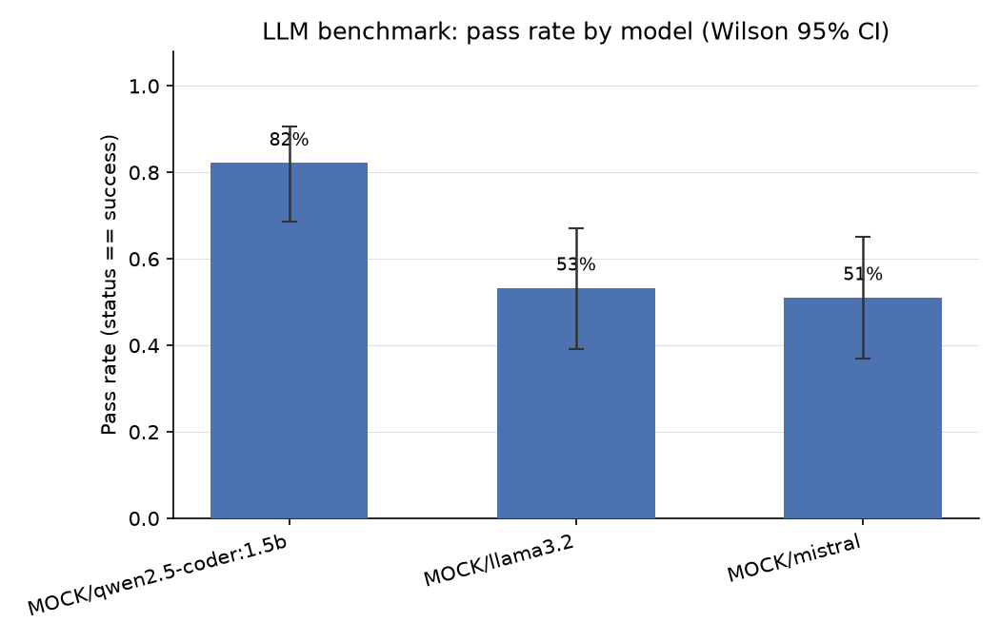

# LLM Benchmark Summary

> **SIMULATED DATA (--mock mode).** These rows come from the offline mock generator, not from real models. They only demonstrate the pipeline; run against a live Ollama server for real results.

Generated from `llm_benchmark/results/results.csv`. 135 attempts across 3 model(s), 15 task(s), 3 repeat(s) per (model, task) pair.

## Pass@1 / Pass@k and cost by model

| model | n_attempts | pass_rate | wilson_lo | wilson_hi | pass@1 | pass@3 | avg_prompt_tokens | avg_output_tokens | avg_latency_sec | avg_tokens_per_sec | cost_per_success_usd | total_cost_usd |
| --- | --- | --- | --- | --- | --- | --- | --- | --- | --- | --- | --- | --- |
| MOCK/qwen2.5-coder:1.5b | 45 | 0.822 | 0.687 | 0.907 | 0.822 | 1.000 | 76.933 | 41.133 | 0.941 | 59.040 | 0.000 | 0.001 |
| MOCK/llama3.2 | 45 | 0.533 | 0.391 | 0.671 | 0.533 | 0.933 | 76.933 | 40.133 | 1.251 | 43.625 | 0.000 | 0.002 |
| MOCK/mistral | 45 | 0.511 | 0.370 | 0.650 | 0.511 | 0.867 | 76.933 | 40.667 | 1.442 | 37.889 | 0.000 | 0.002 |

`pass_rate` = fraction of attempts with status == success. `wilson_lo`/`wilson_hi` are the 95% Wilson score confidence interval on that rate (more reliable than a normal approximation at small sample sizes). `pass@1` and `pass@k` use the unbiased estimator from Chen et al. 2021: `1 - C(n-c, k) / C(n, k)`, averaged per task then across tasks. `cost_per_success_usd` = total simulated API-equivalent cost for the model divided by its count of fully-successful attempts.

## Pass rate by model x task_type (with Wilson 95% CI)

| model | task_type | n_attempts | pass_rate | wilson_lo | wilson_hi | avg_tokens_per_sec | avg_cost_usd |
| --- | --- | --- | --- | --- | --- | --- | --- |
| MOCK/qwen2.5-coder:1.5b | bug_fix | 9 | 0.889 | 0.565 | 0.980 | 62.959 | 0.000 |
| MOCK/mistral | bug_fix | 9 | 0.556 | 0.267 | 0.811 | 40.223 | 0.000 |
| MOCK/llama3.2 | bug_fix | 9 | 0.444 | 0.189 | 0.733 | 44.896 | 0.000 |
| MOCK/qwen2.5-coder:1.5b | code_migration | 12 | 0.833 | 0.552 | 0.953 | 61.385 | 0.000 |
| MOCK/llama3.2 | code_migration | 12 | 0.750 | 0.468 | 0.911 | 43.049 | 0.000 |
| MOCK/mistral | code_migration | 12 | 0.333 | 0.138 | 0.609 | 38.006 | 0.000 |
| MOCK/qwen2.5-coder:1.5b | feature_build | 6 | 0.833 | 0.436 | 0.970 | 57.715 | 0.000 |
| MOCK/mistral | feature_build | 6 | 0.500 | 0.188 | 0.812 | 38.128 | 0.000 |
| MOCK/llama3.2 | feature_build | 6 | 0.333 | 0.097 | 0.700 | 40.642 | 0.000 |
| MOCK/qwen2.5-coder:1.5b | refactor | 9 | 0.889 | 0.565 | 0.980 | 56.629 | 0.000 |
| MOCK/llama3.2 | refactor | 9 | 0.556 | 0.267 | 0.811 | 44.633 | 0.000 |
| MOCK/mistral | refactor | 9 | 0.556 | 0.267 | 0.811 | 36.073 | 0.000 |
| MOCK/mistral | test_generation | 9 | 0.667 | 0.354 | 0.879 | 37.053 | 0.000 |
| MOCK/qwen2.5-coder:1.5b | test_generation | 9 | 0.667 | 0.354 | 0.879 | 55.290 | 0.000 |
| MOCK/llama3.2 | test_generation | 9 | 0.444 | 0.189 | 0.733 | 44.101 | 0.000 |

## Chi-square test: model vs. outcome (success/partial/failed)

Contingency table (rows = model, columns = status):

| model | failed | partial | success |
| --- | --- | --- | --- |
| MOCK/llama3.2 | 6 | 15 | 24 |
| MOCK/mistral | 9 | 13 | 23 |
| MOCK/qwen2.5-coder:1.5b | 2 | 6 | 37 |

Chi2 = 12.651, dof = 4, p-value = 0.01311. p < 0.05: outcome distribution differs significantly by model (models are not interchangeable on this task bank).

## Average hidden-test pass fraction by model (partial-credit view)

| model | avg_test_pass_fraction |
| --- | --- |
| MOCK/qwen2.5-coder:1.5b | 0.883 |
| MOCK/llama3.2 | 0.709 |
| MOCK/mistral | 0.656 |

## Failure/error type breakdown (non-success attempts)

| error_type | count |
| --- | --- |
| AssertionError | 33 |
| SyntaxError | 12 |
| IndentationError | 4 |
| ZeroDivisionError | 2 |

## Chart

